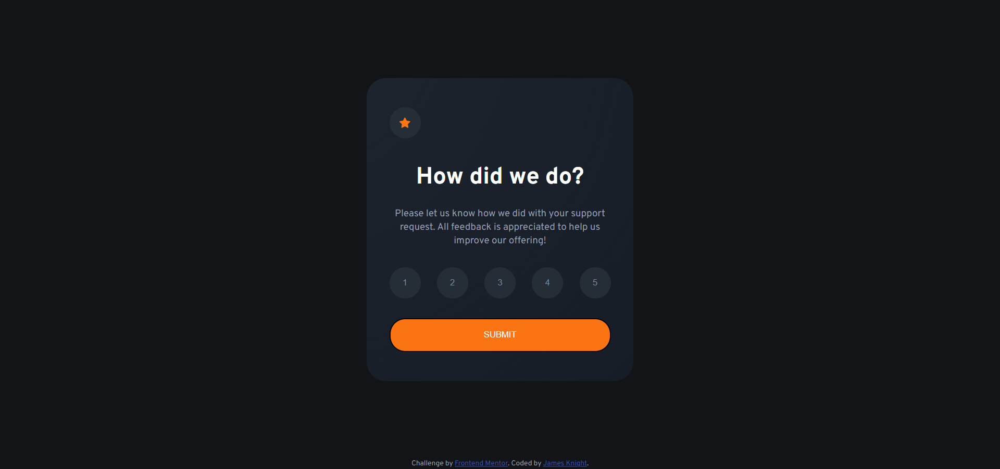

# Frontend Mentor - Interactive rating component solution

This is a solution to the [Interactive rating component challenge on Frontend Mentor](https://www.frontendmentor.io/challenges/interactive-rating-component-koxpeBUmI). Frontend Mentor challenges help you improve your coding skills by building realistic projects.

## Table of contents

- [Overview](#overview)
  - [The challenge](#the-challenge)
  - [Screenshot](#screenshot)
  - [Links](#links)
- [My process](#my-process)
  - [Built with](#built-with)
  - [What I learned](#what-i-learned)
- [Author](#author)

**Note: Delete this note and update the table of contents based on what sections you keep.**

## Overview

### The challenge

Users should be able to:

- View the optimal layout for the app depending on their device's screen size
- See hover states for all interactive elements on the page
- Select and submit a number rating
- See the "Thank you" card state after submitting a rating

### Screenshot

### Links

- Solution URL: [Add solution URL here](https://your-solution-url.com)
- Live Site URL: [Add live site URL here](https://your-live-site-url.com)

## My process

### Built with

- CSS
- Flexbox
- Mobile first
- Javascript Vanilla

### What I learned

This was my first Frontend Mentor challenge, so I used it to get used to the format. I matched it as closely as I could as the screenshots rendered the text slightly different compared with my system (Windows 10, Chrome).

I added a couple of extra little pieces such as an error message if the user tries to click the submit button without selecting a rating. Overall it was a great challenge to begin with and I'm happy with the outcome.

I added just a couple of basic media queries as they weren't really needed, really just adjusting the padding on the rating card, and the spacing on the rating selector buttons.

## Author

- Website - James Knight(https://github.com/jim-knight)
- Frontend Mentor - [@jim-knight](https://www.frontendmentor.io/profile/jim-knight)
