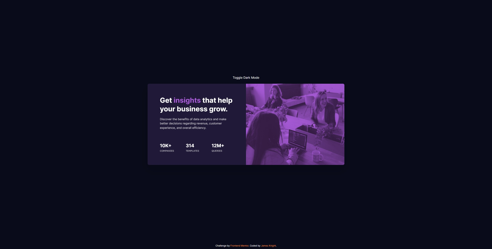

# Frontend Mentor - Stats preview card component solution

This is a solution to the [Stats preview card component challenge on Frontend Mentor](https://www.frontendmentor.io/challenges/stats-preview-card-component-8JqbgoU62). Frontend Mentor challenges help you improve your coding skills by building realistic projects.

## Table of contents

- [Overview](#overview)
  - [The challenge](#the-challenge)
  - [Screenshot](#screenshot)
  - [Links](#links)
- [My process](#my-process)
  - [Built with](#built-with)
  - [What I learned](#what-i-learned)
  - [Continued development](#continued-development)
  - [Useful resources](#useful-resources)
- [Author](#author)

## Overview

### The challenge

Users should be able to:

- View the optimal layout depending on their device's screen size

### Screenshot

### Links

- Solution URL: [https://github.com/jim-knight/Frontend-Mentor/tree/main/03-stats-preview-card-component](https://github.com/jim-knight/Frontend-Mentor/tree/main/03-stats-preview-card-component)
- Live Site URL: [https://fementor-statscard-jknight.netlify.app](https://fementor-statscard-jknight.netlify.app)

## My process

I decided to tackle the challenge again with Tailwind CSS too see how I got on. This time, I went a bit more elaborate with the setup, including a light/dark mode.

I started out by building the HTML framework to start with and from there, pinned down the colors before moving onto font sizing and component spacing. Once that was completed, I got the media queries set up then go to work on dark mode.

### Built with

- Semantic HTML5 markup
- Flexbox
- CSS Grid
- Mobile-first workflow
- [Tailwind CSS](https://tailwindcss.com/) - CSS framework

### What I learned

I'm still not entirely sold on the benefit of Tailwind CSS, just because it does making your working files look so messy but there's benefit to be had I'm sure. It's nice getting to know another toolset and seeing how my own method of building compares when using something more targeted in it's scope.

### Continued development

I'll keep experimenting with Tailwind CSS for personal/ test builds and see if it's something that'll I'll carry over to production builds.

### Useful resources

- [Tailwind CSS docs](https://tailwindcss.com/docs/installation) - Definitely helpful for referencing what classes should be used.

## Author

- Website - [James Knight](http://jknight.space/)
- Frontend Mentor - [@jimknight](https://www.frontendmentor.io/profile/jim-knight)
